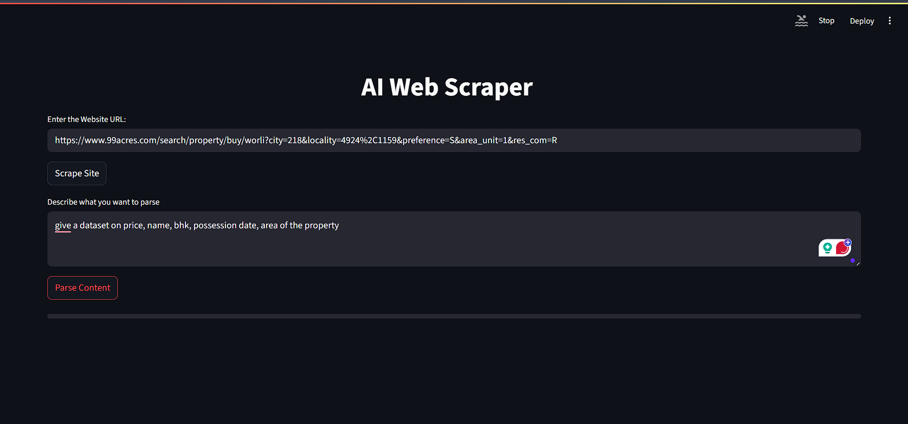
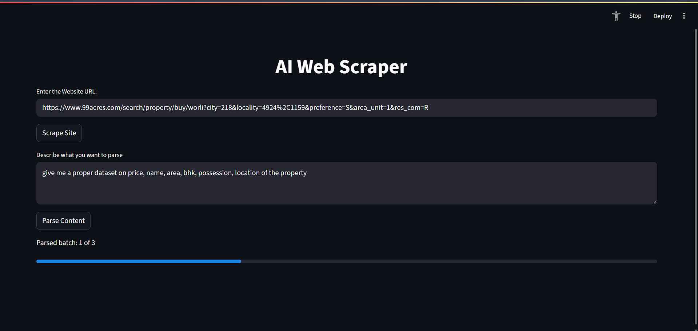
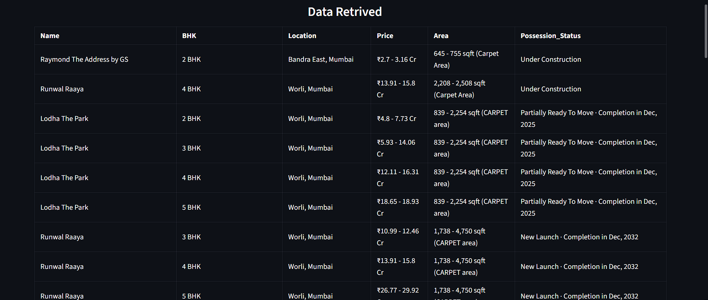
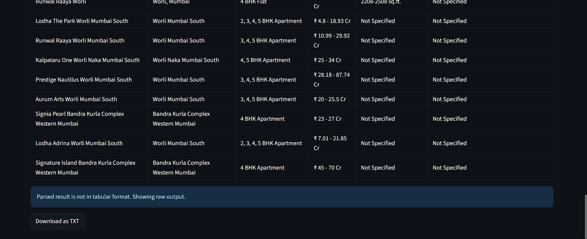

# AI Web-Scraper



An intelligent web scraping app powered by Gemini (Google Generative AI) that scrapes website content and parses specific information using natural language prompts.

---


## 🚀 Features

- 🌐 Scrape website content using a URL
- 🧹 Clean and extract body content
- ✂️ Split large DOM content into manageable chunks
- 🤖 Use Gemini AI to parse specific information from the page
- 📥 Export parsed results to CSV
- 🔄 Proxy/IP rotation support (planned)

---

---

## 🧰 Technologies Used

- Python
- Streamlit
- LangChain
- Gemini (via `langchain_google_genai`)
- BeautifulSoup4
- Pandas


---

## 📦 Setup Instructions

```bash
git clone https://github.com/your-username/ai-web-scraper.git
cd ai-web-scraper
python -m venv venv
venv\Scripts\activate   # On Windows
pip install -r requirement.txt
