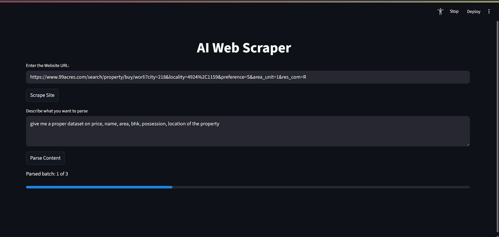
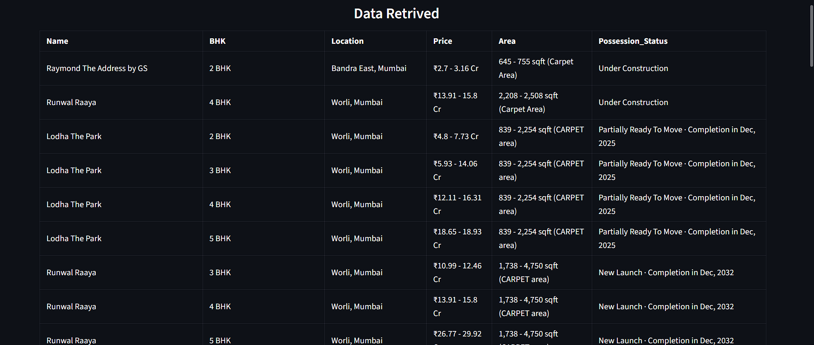

# AI Web Scraper

**Prompt-Driven Intelligent Web Scraping Engine**  
Extract structured data from websites using natural language instructions.

---

## Overview

**AI Web Scraper** is an intelligent web scraping application that combines traditional scraping techniques with **Google Gemini (Generative AI)** to extract *specific, user-defined information* from websites.

Instead of writing brittle CSS selectors or custom parsing logic, users describe **what they want in plain English**, and the system uses an LLM to interpret and extract relevant information from the scraped content.

This project focuses on **automation, flexibility, and robustness** in real-world web data extraction.

---

## Application Preview




---

## Key Features

- Scrape website content using a URL
- Clean and extract meaningful body content
- Split large DOM content into manageable chunks
- Use **Gemini AI** to parse specific information via natural language prompts
- Download extracted data as **TXT** or **CSV**
- No manual selector writing required

---

## How It Works (High-Level)

1. **User inputs a URL**
2. Website content is fetched using Selenium / BeautifulSoup
3. Raw HTML is cleaned and reduced to meaningful text
4. Large pages are split into smaller chunks
5. Gemini processes chunks using the user’s prompt
6. Parsed results are aggregated and returned
7. Output can be downloaded as structured data

This hybrid approach combines:
- Deterministic scraping (for reliability)
- Probabilistic parsing (for flexibility)

---

## Use Cases

- Extract product details from e-commerce sites
- Pull job listings or descriptions
- Scrape FAQs, policies, or documentation
- Research and competitive analysis
- Rapid data extraction without writing custom scrapers

---

## Tech Stack

| Tool / Library | Purpose |
|---------------|---------|
| **Python** | Core programming language |
| **Streamlit** | Interactive web interface |
| **Google Gemini** | AI-powered content parsing |
| **BeautifulSoup4** | HTML parsing |
| **Selenium** | Dynamic website scraping |
| **LangChain** | LLM orchestration |
| **Pandas** | Data manipulation & export |

---

## Setup Instructions

### Clone the Repository

```bash
git clone https://github.com/aadesh006/ai-web-scraper.git
cd ai-web-scraper
```

---

### Notes & Limitations

- Some websites may block automated scraping
- AI responses may vary depending on prompt clarity
- Designed for experimentation and research, not high-scale crawling
- Accuracy depends on the quality of the page content
